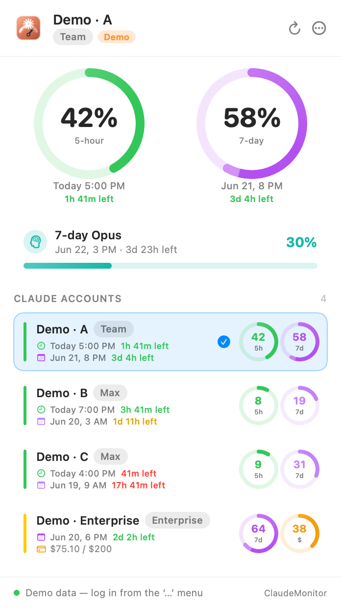
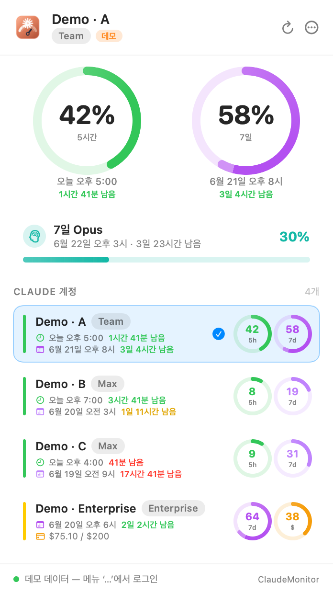

<p align="center">
  
</p>

<p align="center">
  <a href="https://github.com/KimSoungRyoul/ClaudeMonitor/releases/latest"></a>
  <a href="https://github.com/KimSoungRyoul/ClaudeMonitor/releases/latest"></a>
  <a href="https://github.com/KimSoungRyoul/ClaudeMonitor/releases/latest"></a>
  <a href="LICENSE"></a>
</p>

<p align="center">
  Track usage for <b>multiple Claude accounts</b> right from the macOS menu bar — 5-hour / 7-day limits, Opus·Sonnet limits, and Extra Usage ($), per account, with quick switching.
</p>

<p align="center">
  <b>⬇️ <a href="https://github.com/KimSoungRyoul/ClaudeMonitor/releases/latest">Download the latest .dmg</a></b> — drag ClaudeMonitor.app into Applications. Ad-hoc signed → first launch: right-click → Open.
</p>

> Inspired by [Usage4Claude](https://github.com/f-is-h/Usage4Claude) — thanks! 🙏

<p align="center">
  
  &nbsp;&nbsp;
  
</p>

## Features

- 📊 Menu-bar label with the active account's 5h / 7d usage in color
- 🎯 Popover: dual ring gauges (5-hour + 7-day) with reset time and remaining time, plus Opus/Sonnet/Extra cards
- 👥 Multi-account / multi-org: every organization reachable by one session key is registered automatically; switch with a tap
- ⏱️ Remaining-time colors: 5h → red under 1 hour; 7d → red under 1 day, gold under 2 days, else green
- 🌐 Built-in browser (WKWebView) login auto-extracts the session key; manual paste also supported
- 🔐 Session key stored in the Keychain (only account metadata in UserDefaults)
- 🔄 Auto-refresh (1/3/5/10/30 min) + manual refresh
- 🆕 Update check against GitHub Releases — suggests a download when a newer version exists
- 🌏 English / 한국어 (System / English / Korean) in Settings
- 🧪 Demo mode with sample data when no account is configured

## Install

Download the DMG from the [latest release](https://github.com/KimSoungRyoul/ClaudeMonitor/releases/latest), open it, and drag **ClaudeMonitor.app** into Applications. The app is ad-hoc signed, so on first launch use right-click → Open (Gatekeeper).

Then click the menu-bar gauge icon → `…` → **Add Claude account / Log in** and sign in to claude.ai.

## Build from source

```bash
# Release build + .app bundle + ad-hoc sign + install to /Applications
./scripts/build_app.sh

# Or just compile
swift build -c release
```

Requires macOS 14+ and a Swift 6 toolchain (Xcode 16).

## Unofficial claude.ai API

| Endpoint | Purpose |
|---|---|
| `GET /api/organizations` | Organizations reachable by the session |
| `GET /api/organizations/{uuid}/usage` | `five_hour` / `seven_day` / `seven_day_opus` / `seven_day_sonnet` (utilization, resets_at) |
| `GET /api/organizations/{uuid}/overage_spend_limit` | Extra Usage (overage spend) |

Auth: `Cookie: sessionKey=sk-ant-...` plus browser-mimicking headers (`anthropic-client-platform`, `origin`, `referer`, `sec-fetch-*`) to pass Cloudflare.

## Project layout

```
Sources/ClaudeMonitor/
  EntryPoint.swift          entry (preview vs app branch)
  App.swift                 MenuBarExtra app + WindowManager
  AppState.swift            global state (accounts/usage/refresh/menu-bar image/language/update check)
  Localization.swift        AppLanguage + L.s("ko","en")
  Models/Models.swift       API responses + normalized models + Account
  Services/ClaudeAPI.swift  API client (Cloudflare-bypass headers)
  Services/Keychain.swift   session key storage
  Services/UpdateChecker.swift  GitHub releases/latest check
  Views/                    Theme, Components (RingGauge/MiniRing/Bar), PopoverView,
                            UsageSections, SettingsView, WebLoginView, MenuBarRenderer
```

## Acknowledgements

Inspired by [**Usage4Claude**](https://github.com/f-is-h/Usage4Claude) — its menu-bar app UX inspired ClaudeMonitor's design. Thanks! 🙏

## License

[MIT](LICENSE) © KimSoungRyoul. Provided "as is", without warranty; uses an unofficial endpoint that may change at any time.
